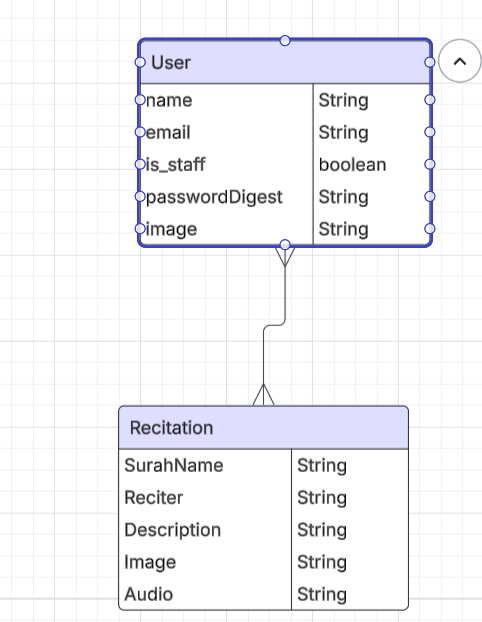
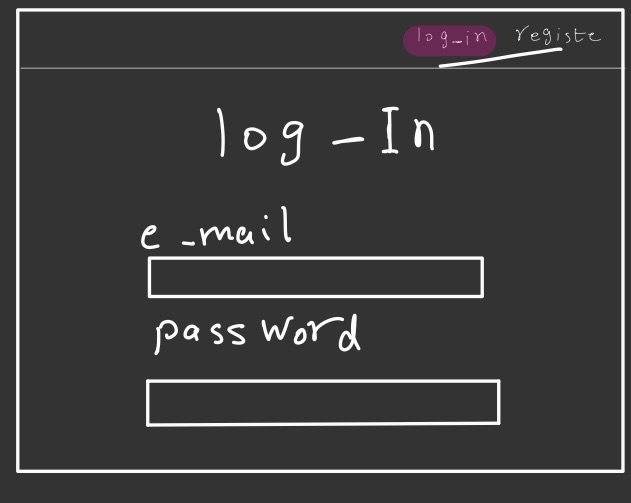

# Mustama  

Mustama is a website that allows you to listen to your favorite Quran reciters and also upload your own recitations to share with others in the community.  

---

## Initial ERD  

---

## Framework  
The following images show the framework and workflow used in building the project:  

  
  
  
  
  
  
  
  

---

## Future Enhancements  
1. Add a search bar for all records  
2. Implement skip and previous buttons for Surahs  

---

## Most Difficult Part  
The most difficult part of the project was:  
- Designing and structuring the CSS  
- Implementing the play and pause logic for audio elements  

---

## Most Fun Part  
The most enjoyable part of development was working on:  
- Authorization and permission handling for accessing specific pages  

---

## Project Highlights  
- Listen to a variety of Quran reciters  
- Upload and share your own recitations  
- Clean and structured framework  
- Focus on user permissions and secure access  
## Resources that help me
[django](https://www.djangoproject.com/)

[w3school](https://www.w3schools.com/)