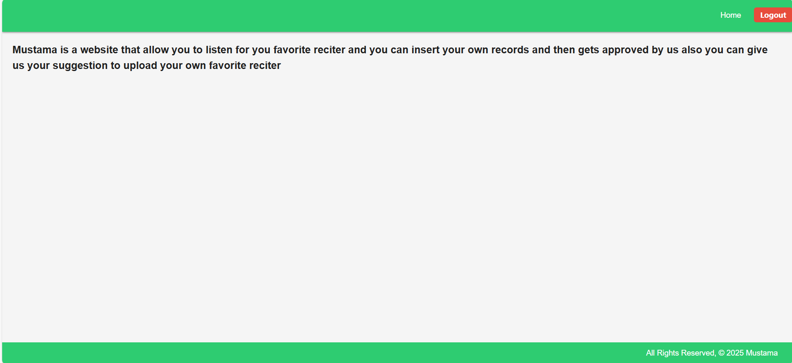

# Mustama  

## 📝 Description  

**Mustama** is a web application that allows users to **listen to their favorite Quran reciters** and also **upload their own recitations** to share with the community.  

The platform is designed to provide an easy-to-use interface for both listening and contributing recitations, while also ensuring proper **authorization and permissions** for secure access.  

---  

## 📋 Table of Contents  

- [📝 Description](#-description)  
- [📋 Table of Contents](#-table-of-contents)  
- [🚀 Getting Started](#-getting-started)  
- [🛠️ Technologies](#-technologies)  
- [📊 ERD](#erd)  
- [🖼️ Framework & Screenshots](#framework--screenshots)  
- [🧩 Challenges Faced](#-challenges-faced)  
- [🎉 Fun Aspects](#-fun-aspects)  
- [✨ Possible Future Enhancements](#-possible-future-enhancements)  
- [🙌 Credits & Resources](#-credits--resources)  
- [👤 Author](#-author)  

---  

## 🚀 Getting Started  

Follow these steps to start using **Mustama**:  

1. **Sign Up / Log In** to access your personalized account.  
2. **Browse and listen** to available Quran recitations.  
3. **Upload your own recitation** and share it with the community.  
4. Enjoy a **secure and smooth experience** with proper permission handling.  

---  

## 🛠️ Technologies  

- **`Python`** & **`Django`** : Backend framework for building robust and scalable web applications.  
- **`SQLite / PostgreSQL`** : Database for storing user records and recitations.  
- **`HTML5, CSS3, JavaScript`** : Frontend technologies for styling and interactivity.  
- **`Bootstrap`** : Used for responsive design and UI components.  

---  

# 📊 ERD  

  

The ERD illustrates how **Users** and **Recitations** are structured and linked within the system.  

---  

# 🖼️ Framework & Screenshots  

The following images show the framework and different pages of the project:  

- **About Page**  
  

- **All Records (Admin View)**  
  

- **Approval Page**  
  

- **Home Page**  
  

- **Record List Page**  
  

- **My Record List**  
  

- **Insert Record**  
  

- **Information Page**  
  

---  

## 🧩 Challenges Faced  

- **Designing and structuring CSS** for a clean and consistent UI.  
- **Implementing audio play/pause logic** to ensure seamless playback.  

---  

## 🎉 Fun Aspects  

- Working on **authorization and permission handling** for secure access.  
- Seeing the project come together with a structured and user-friendly design.  

---  

## ✨ Possible Future Enhancements  

1. Add a **search bar** to quickly find recitations.  
2. Implement **skip and previous buttons** for Surah playback.  

---  

## 🙌 Credits & Resources  

- [Django Official Documentation](https://www.djangoproject.com/)  
- [W3Schools](https://www.w3schools.com/)  

---  

# 👤 Author  

### Qassim Alderazi  

📫 Email: [Qm8222606@gmail.com](mailto:Qm8222606@gmail.com)  
🔗 GitHub: [Qassim Alderazi](https://github.com/QassimAlderazi)  
💼 LinkedIn: [Qassim Alderazi](https://www.linkedin.com/in/qassim-alderazi-0111402b5/)  
